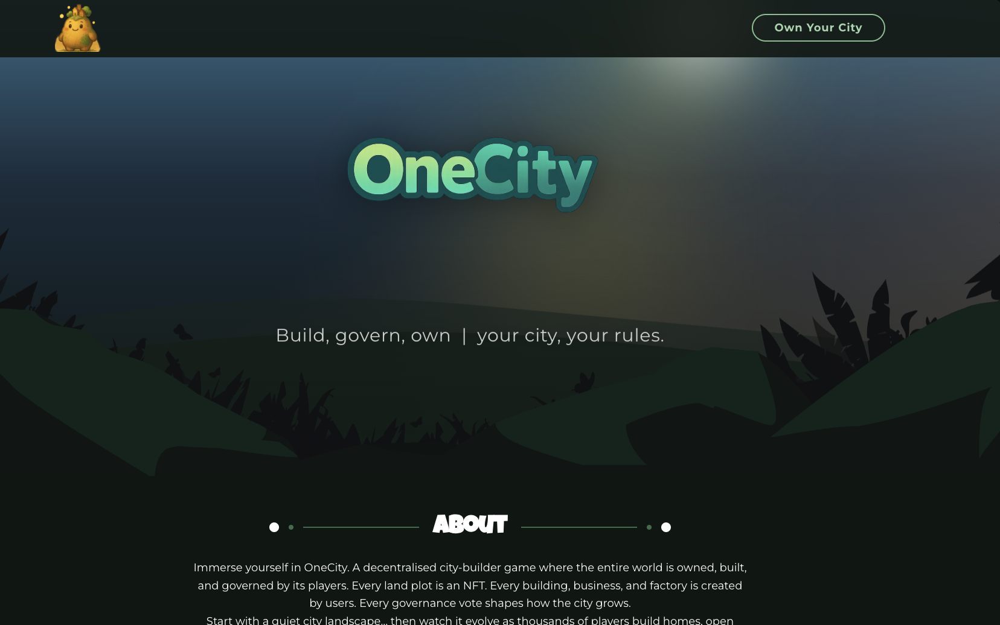
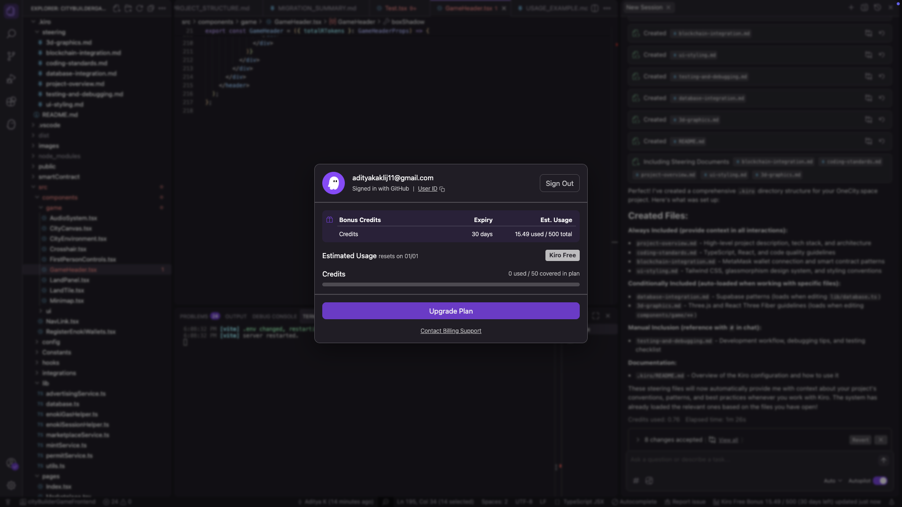
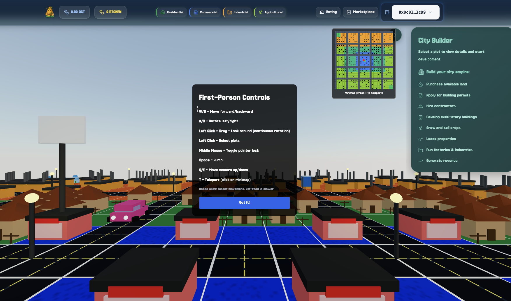
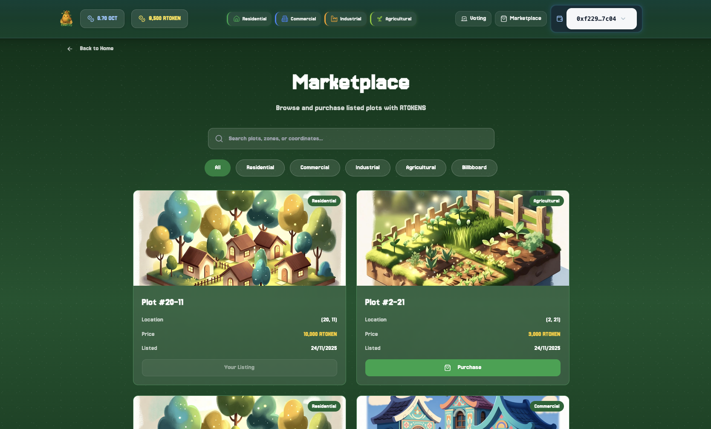
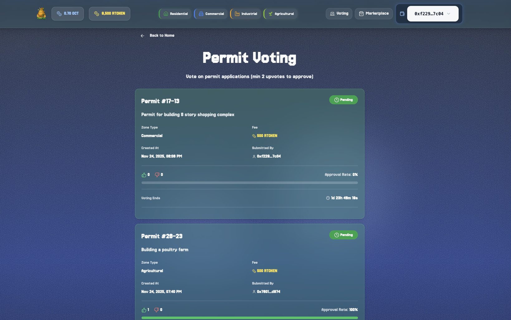

# OneCity.space - Frontend Application

Frontend application for the decentralized city building game on Somnia blockchain, built with React, Three.js, and MetaMask wallet integration.

<div align="center">

  

</div>


## Built with KIRO

<div align="center">

  

</div>
## 🔗 Project Links

- **Official Landing Page:** [onecity.space](https://www.onecity.space/)
- **Play the Game:** [app.onecity.space](https://app.onecity.space/)
- **Smart Contract Repository:** See smart contract [repo]() 

## 🎮 Overview

This frontend application provides a 3D first-person city building experience where players interact with the OneCity smart contract on Somnia blockchain. Players can mint land NFTs, trade properties, apply for construction permits, vote on governance proposals, and lease advertising space.

<div align="center">

  

</div>

## 🔗 Blockchain Interactions


The application supports wallet connections via:
- **MetaMask** - Industry-standard Ethereum wallet for seamless Web3 integration
- Automatic connection on page load if MetaMask is installed
- Wallet address stored and available for all blockchain interactions

### 1. Land Minting

**Transaction Flow:**
- User selects coordinates (x, y) on the 3D grid
- Connects MetaMask wallet
- Pays minting fee to mint land NFT
- Receives **RTOKENs** as reward
- Land NFT is minted on-chain with metadata (coordinates, zone type, image URL)

**Key Features:**
- MetaMask transaction signing
- On-chain NFT minting with unique coordinates
- Automatic RTOKEN reward distribution
- Real-time transaction status updates

### 2. Marketplace Trading

**List for Sale:**
- Land owners list properties with custom RTOKEN price
- MetaMask transaction creates listing on-chain
- Listing stored in database for UI display

**Purchase:**
- Buyers pay RTOKENs to purchase listed properties
- RTOKENs transferred from buyer to seller via smart contract
- Land ownership transferred on-chain
- MetaMask confirms all transactions

**Key Features:**
- Secure peer-to-peer trading
- Custom pricing in RTOKENs
- Instant ownership transfer
- Transaction history tracking

<div align="center">

  

</div>

### 3. Governance & Permits

**Apply for Permit:**
- Land owners apply for construction permits
- Costs **500 RTOKENs** (deducted from plot's RTOKEN balance)
- Creates permit on-chain with description via MetaMask

**Vote on Permits:**
- NFT holders vote on permit applications (upvote/downvote)
- Minimum **2 upvotes** required for approval
- Permit owners cannot vote on their own permits
- All votes recorded on Somnia blockchain

**Update Permit Status:**
- Once approved (≥2 upvotes), permit status updated to "approved"
- Enables construction to begin
- Status changes confirmed via MetaMask transaction

**Key Features:**
- Decentralized governance system
- Community-driven approval process
- Transparent voting on-chain
- Automated permit status updates

<div align="center">

  

</div>

### 4. Billboard Advertising

**List Billboard:**
- Land owners with billboards can list advertising space
- Set custom RTOKEN price for lease
- Creates advertising listing on-chain via MetaMask

**Lease Billboard:**
- Advertisers pay RTOKENs to display content
- Image URL stored on-chain
- RTOKENs transferred from advertiser to land owner
- All transactions secured by Somnia blockchain

**Key Features:**
- Monetize land with billboard advertising
- Custom pricing for ad space
- On-chain content verification
- Instant RTOKEN payments

##  Tech Stack

- **Frontend Framework:** React 18 + TypeScript
- **3D Graphics:** Three.js + React Three Fiber
- **Blockchain:** Somnia (EVM-compatible)
- **Wallet Integration:** MetaMask (Web3 Provider)
- **Database:** Supabase (PostgreSQL)
- **UI Components:** shadcn/ui + Radix UI
- **Styling:** Tailwind CSS
- **Build Tool:** Vite

## Project Structure

```
src/
├── components/
│   ├── game/              # 3D game components
│   │   ├── CityCanvas.tsx      # Main 3D scene
│   │   ├── FirstPersonControls.tsx  # Player controls
│   │   ├── LandTile.tsx        # Individual land tiles
│   │   ├── LandPanel.tsx       # Land interaction panel
│   │   └── Minimap.tsx         # Mini map view
│   └── ui/                # Reusable UI components
├── lib/
│   ├── mintService.ts          # Land minting transactions
│   ├── marketplaceService.ts   # Marketplace transactions
│   ├── permitService.ts        # Permit & governance transactions
│   ├── advertisingService.ts   # Billboard advertising transactions
│   ├── database.ts             # Supabase database operations
│   └── enokiGasHelper.ts       # Enoki wallet gas handling
├── pages/
│   ├── Index.tsx          # Main game page
│   ├── Marketplace.tsx    # Marketplace page
│   └── Voting.tsx         # Governance voting page
└── Constants/
    └── constants.js       # Contract addresses & configuration
```

##  Getting Started

### Prerequisites

- Node.js 18+ or Bun
- MetaMask browser extension installed
- Somnia testnet configured in MetaMask
- Supabase account (for database)


##  Configuration

### MetaMask Setup

Add Somnia testnet to MetaMask:
- **Network Name:** Somnia Testnet
- **RPC URL:** [Somnia RPC endpoint]
- **Chain ID:** [Somnia Chain ID]
- **Currency Symbol:** [Native token symbol]

### Smart Contract Configuration

Contract addresses are configured in `src/Constants/constants.js`:

```javascript
// Update with Somnia contract addresses
export const ContractAddress = "[Somnia Contract Address]"
export const LandRegistry = "[Land Registry Address]"
export const PermitRegistry = "[Permit Registry Address]"
export const UserBalance = "[User Balance Address]"
```

**Network:** Somnia Testnet

## Key Features

### 3D First-Person Experience
- Navigate the city in first-person view
- Click on land plots to interact
- Minimap for navigation
- Real-time 3D rendering with Three.js

### Real-Time Blockchain Sync
- Automatic plot ownership updates
- RTOKEN balance tracking
- Transaction status monitoring
- Database synchronization with on-chain state

### User Interface
- Responsive design with modern UI components
- Toast notifications for transaction status
- Loading states and error handling
- Wallet connection management

##  Transaction Flow Examples

### Minting Land
1. User clicks on unowned plot in 3D view
2. Clicks "Purchase" button
3. MetaMask prompts for transaction approval
4. Transaction submitted to Somnia blockchain
5. Frontend waits for confirmation
6. Land NFT minted with unique ID
7. Plot saved to Supabase database
8. UI updates to show ownership

### Purchasing from Marketplace
1. User browses listings on Marketplace page
2. Clicks "Purchase" on desired listing
3. MetaMask checks RTOKEN balance
4. User approves purchase transaction
5. Ownership transferred on-chain
6. RTOKENs transferred to seller
7. Listing marked as sold in database

### Applying for Permit
1. User selects owned plot
2. Clicks "Apply for Permit"
3. Enters description
4. MetaMask prompts for transaction (500 RTOKENs)
5. Permit created on Somnia blockchain
6. Permit saved to database with "pending" status
7. Appears on Voting page for community voting


##  Troubleshooting

### MetaMask Connection Issues
- Ensure MetaMask extension is installed and unlocked
- Verify you're connected to Somnia testnet
- Check that the correct network is selected in MetaMask

### Transaction Failures
- Ensure sufficient native tokens for gas fees
- Check RTOKEN balance for permit/advertising operations
- Verify wallet is connected to Somnia testnet
- Confirm transaction in MetaMask popup

### Common Issues
- **"Install MetaMask" message:** Install the MetaMask browser extension
- **Transaction rejected:** User cancelled transaction in MetaMask
- **Insufficient funds:** Add testnet tokens to your wallet

---

**Network:** Somnia Testnet  
**Wallet:** MetaMask

